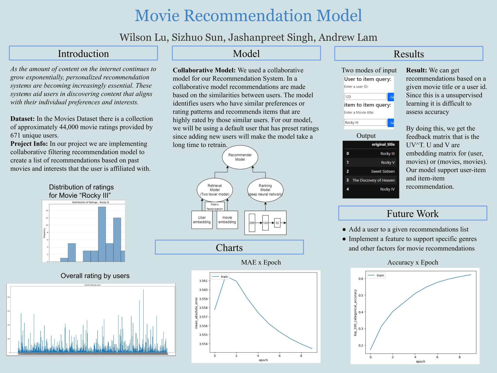

# Movie Recommendation System

## Poster



## Introduction
A movie recommendation system project based on tensorflow-recommender library

## Dataset
https://www.kaggle.com/datasets/rounakbanik/the-movies-dataset

## How to use the demo
> **⚠️ Important Notification**: \
> Our live demo need to train the model (use num_epoch = 1 to save time). A GPU accelerator is preferred for this model as our hyperparameter is big. CPU is supported but it takes 10 times longer than a GPU accelerator.
### Firstly, cd into the folder deploy-ml-proj
```console
$ cd deploy-ml-proj
```
### Make sure you have installed all the required libraries in [`requirements.txt`](./deploy-ml-proj/requirements.txt)
```console
$ pip install -r requirements.txt
```
### You can start the live demo server by typing the command below
```console
$ python3 -m app
```
or
```console
$ python3 app.py
```

## Demo Example


## Tree structure
```console
.
├── Notebook
│   ├── data_process.ipynb
│   ├── load_model_testing.ipynb
│   ├── main-dim32.ipynb
│   ├── main-dim64-sigmoid-sgd.ipynb
│   ├── main-dim64.ipynb
│   ├── main.ipynb
│   └── test_RS.ipynb
├── README.md
├── dataset
│   ├── keywords.csv
│   ├── links.csv
│   ├── links_small.csv
│   ├── movies_metadata.csv
│   └── ratings_small.csv
├── deploy-ml-proj
│   ├── app.py
│   ├── requirements.txt
│   ├── style
│   └── templates
│       ├── index.html
│       ├── result_movie.html
│       └── result_user.html
├── docs
│   ├── dataset.md
│   ├── hyperparameter.csv
│   ├── latex_handbook.md
│   ├── question.md
│   ├── source.md
│   ├── term_checklist.md
│   └── use_git.md
├── image
│   ├── Model_details.drawio
│   ├── Movie_Recommendation_Poster.svg
│   └── demo_present.gif
├── model
│   ├── MRS_v1.h5
│   ├── MRS_v2.h5
│   ├── MRS_v2_e32.h5
│   ├── MRS_v2_e64_12.h5
│   ├── MRS_v2_e64_20.h5
│   ├── MRS_v2_e64_20_ep5.h5
│   ├── MRS_v2_e64_20_ep5.tf.data-00000-of-00001
│   ├── MRS_v2_e64_20_ep5.tf.index
│   ├── MRS_v3_sgd_e64_12.h5
│   └── checkpoint
├── report
│   ├── img
│   └── report.tex
└── src
    └── main.py
```

## docs folder
### [use_git](./docs/use_git.md)
- git command manual
### [latex_handbook](./docs/latex_handbook.md)
- latex usage manual
### [question](./docs/question.md)
- question I asked during office hour
### [source](./docs/source.md)
- Some useful source we can use in the report
### [term_checklist](./docs/term_checklist.md)
- Important source you need to know for presentation
### [dataset](./docs/dataset.md)
- dataset explanation

## notebook folder
### [main.ipynb](./Notebook/main.ipynb)
- jupyter notebook for final model
### [test_RS.ipynb](./Notebook/test_RS.ipynb)
- jupyter notebook for model_v1
### [load_model_testing.ipynb](./Notebook/load_model_testing.ipynb)
- jupyter notebook for loading model from .h5/.tf file
### [data_process.ipynb](./Notebook/data_process.ipynb)
- jupyter notebook for data processing and data slicing

## deploy-ml-proj
### [app.py](./deploy-ml-proj/app.py)
- the main backend code to start the web service
### [templates](./deploy-ml-proj/templates/)
- folder to store html files

## report folder
### [main.tex](./report/main.tex)
- main Latex file for our report
### [title.tex](./report/title.tex)
- Latex file for title page
### [main.pdf](./report/main.pdf)
- pdf format of our report

## model folder
-  contains trained model
### [MRS_v1.h5](./model/MRS_v1.h5)
- model_v1
### [MRS_v2.h5](./model/MRS_v2.h5)
- model_v2

## **Contributer**:
- - *Sizhuo Sun*
- - *Wilson Lu*
- - *Jashanpreet Singh*
- - *Andrew Lam*
